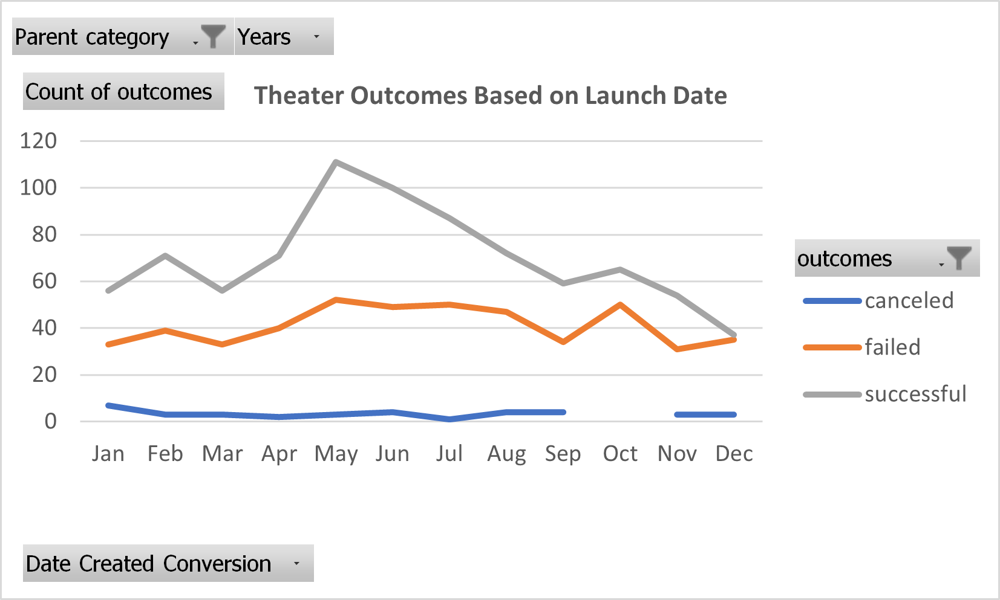
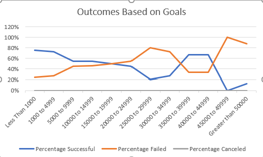

# kickstarter-analysis
Performing analysis on Kickstarter data to uncover trends

## Overiview of Project
Louise is fundraising for her new play called Fever. She wants to be informed about her decision making and will anlayze over 4000 fundraising campaigns.
### Purpose
She wants to know how other fundraising campaigns fared in relation to their launch dates and their funding goals. We need to try to undertand how launch dates and fnding goals have impacted other fundraising campaigns.
### Challenges and Difficulties Encountered
- One challenge I had with the Outcomes Based on Launch Date related to filtering the proper data. Since Louise specifically wanted to analyze theater fundraising campaigns, we needed to filter for the appropriate field.
-Another challenge I encountered with the Outcomes Based on Goals was configuring an efiicient way to calculate all the outcomes without hving to edit every CountIf function for the dataset.
	* Another difficulty I faced with this data was filtering the X axis of my line chart to show Percentages instead of the fixed goal number for each campaign.
## Results
### Analysis of Outcomes Based on Launch Date
Looking at the , we can draw a couple conclusions:
- First, the most successful theater campaigns launch in May and then the campaign success starts to average out over the remaining month in the year.
- Second, the failed theater campaigns were consistent throughout the year with a slight peak in October. It's important to note that the successful campaigns contnue to decrease in October as the year ends.
### Analysis of Outcomes Based on Goals
Campaign outcomes based on goals appears to have a significant impact with regards to the success of the fundraising campaigns. It's apparent when looking at  that campaigns were overall more successful when they had a lower goal amount. Goals over 40000 start to fail drastically with almost a 0% success rate.
1. It's important to understand the limitations of this data set. The fundraising campaigns vary with many other variables determining their success as a campaign, and our analysis can not account for all these variables specific to each campaign. 
2. I would highly recommend using additional tables and graphs in Louise's analysis of the fundraising campaigns for data driven reccomendations regarding her campaign.
